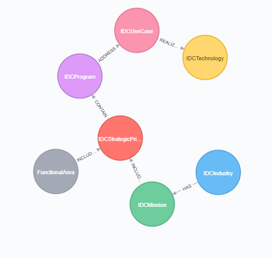

# Import and review of IDC digital use cases 2018

- refresh based on October 2018 dataset

## Initial model

* [Import Scripts](importScripts.md)
* [graph.db 4 neo4j](database/graph.db.7z)
* [Setup your neo4j sandbox](https://github.dxc.com/DigitalExplorer/Digital-Explorer-Specs/blob/master/Sandbox/SandboxSetup/readme.md)

---

## Results

### Common Strategic Priorities across Industries

#### October 2018 view
|Strategic Priority                     |count|
|---|---|
|omni-experience customer engagement|	6
|digital supply chain optimization|	5
|smart manufacturing|	4
|connected assets|	3
|omni-channel commerce|	3
|next gen safety|	3
|operational scale & agility|	2
|intelligent transportation|	2
|operationalizing data and information|	2
|operational scale and agility|	2
|digital innovation|	2

#### April 2018 view

|Strategic Priority                     |count|
|---|---|
|smart manufacturing                  |4      |
|omni-experience customer engagement  |4      |
|connected assets                     |3      |
|next gen safety                      |3      |
|digital supply chain optimization    |3      |
|digital supply chain                 |2      |
|innovation acceleration              |2      |
|intelligent transportation           |2      |
|operational scale & agility          |2      |
|operationalizing data and information|2      |

~~~
MATCH (sp:IDCStrategicPriorities)--(m:IDCMission)
WITH sp.name as StrategicPriority, collect(sp) as nodelist, Count(*) as count
WHERE count > 1
RETURN StrategicPriority, count
ORDER BY count desc
LIMIT 20
~~~

### Common Strategic Priorities across Technology Programs

#### October 2018 view
|Strategic Priority|count|
|---|---|
|deriving value from data|	8
|digital innovation acceleration|	8
|digitizing procurement & partnerships|	7
|buildings of the future|	7
|strategically-aligned workforce|	6
|differentiated customer experience|	5
|growing and protecting the digital organization|	5

~~~
MATCH (fa:FunctionalArea)--(sp:IDCStrategicPriorities)--(p:IDCProgram)
WITH sp.name as StrategicPriority, collect(sp) as nodelist, Count(*) as count
WHERE count > 1
RETURN StrategicPriority, count
ORDER BY count desc
LIMIT 20
~~~

### most connected technologies

#### October 2018 view
|Technology Name|count|
|---|---|
|IoT|	184
|Cloud|	160
|BDA|	105
|cognitive|	85
|analytics|	78
|cloud|	62
|Cognitive|	59
|Mobile|	48
|social|	47
|AI|	46
|machine learning|	45
|PLM|	42
|AR/VR|	41
|mobile|	41
|smartphones|	41
|industry cloud|	37
|storage|	35
|ERP|	33
|tablets|	33
|data management|	30

#### April 2018 view

|Technology Name|count|
|---|---|
|cloud                 |196    |
|iot                   |144    |
|cognitive             |134    |
|bda                   |96     |
|mobile                |95     |
|social                |70     |
|analytics             |70     |
|industry cloud        |61     |
|machine learning      |47     |
|advanced analytics    |31     |
|ar/vr                 |30     |
|sensors               |30     |
|mobile apps           |24     |
|next-gen security     |20     |
|robotics              |19     |
|data management       |18     |
|cognitive technologies|17     |
|blockchain            |17     |
|big data              |16     |
|mobility              |15     |

~~~
MATCH (t:IDCTechnology)--(uc:IDCUseCase)
WITH t.name as TechnologyName, collect(t) as nodelist, Count(*) as count
WHERE count > 1
RETURN TechnologyName, count
ORDER BY count desc
LIMIT 30
~~~