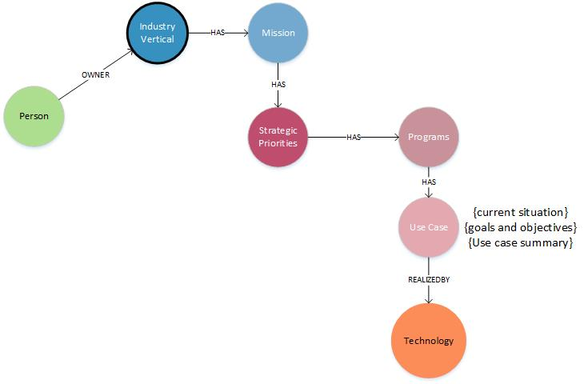
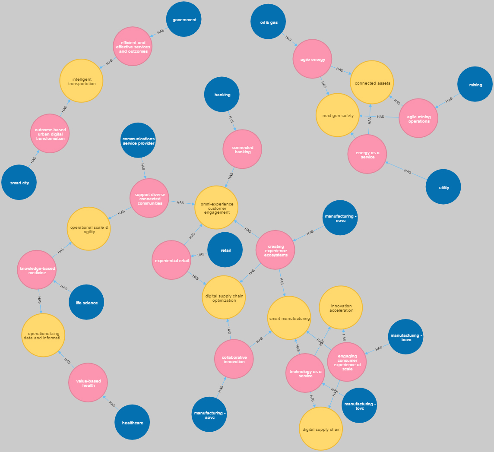

# Import and review of IDC digital use cases 2018

### Initial model

* [Import Scripts](importScripts.md)
* [graph.db 4 neo4j](graph.db.zip)

---

## Results

### Common Strategic Priorities across Industries

|Strategic Priority                     |count|
|---|---|
|smart manufacturing                  |4      |
|omni-experience customer engagement  |4      |
|connected assets                     |3      |
|next gen safety                      |3      |
|digital supply chain optimization    |3      |
|digital supply chain                 |2      |
|innovation acceleration              |2      |
|intelligent transportation           |2      |
|operational scale & agility          |2      |
|operationalizing data and information|2      |

~~~
MATCH (sp:StrategicPriorities)--(m:Mission)
WITH sp.name as StrategicPriority, collect(sp) as nodelist, Count(*) as count
WHERE count > 1
RETURN TechnologyName, count
ORDER BY count desc
LIMIT 20
~~~

### most connected technologies

|Technology Name|count|
|---|---|
|cloud                 |196    |
|iot                   |144    |
|cognitive             |134    |
|bda                   |96     |
|mobile                |95     |
|social                |70     |
|analytics             |70     |
|industry cloud        |61     |
|machine learning      |47     |
|advanced analytics    |31     |
|ar/vr                 |30     |
|sensors               |30     |
|mobile apps           |24     |
|next-gen security     |20     |
|robotics              |19     |
|data management       |18     |
|cognitive technologies|17     |
|blockchain            |17     |
|big data              |16     |
|mobility              |15     |

~~~
MATCH (t:Technology)--(uc:UseCase)
WITH t.name as TechnologyName, collect(t) as nodelist, Count(*) as count
WHERE count > 1
RETURN TechnologyName, count
ORDER BY count desc
LIMIT 20
~~~