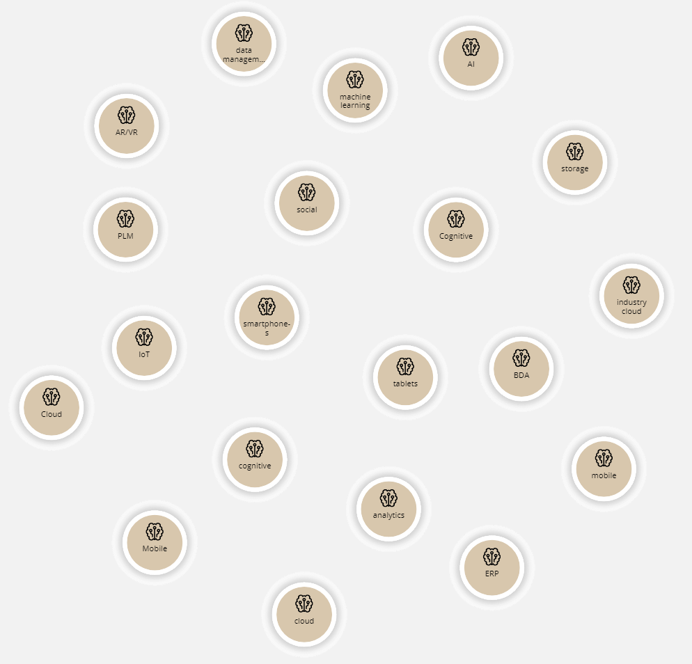

## Bloom Queries

`Top Technology`

~~~
match (t:IDCTechnology) return t order by t.UCCount DESC limit 20
~~~

`TopTechUseCases`
~~~
match (t:IDCTechnology)-[r]-(uc:IDCUseCase) where t.UCCount > 3 and uc.PCount >2 return t,uc, r
~~~

`TopTechUseCasesAll`
~~~
match (t:IDCTechnology)-[r]-(uc:IDCUseCase) where t.UCCount > 3 return t,uc, r
~~~

`TopUseCases`

~~~
match (i:IDCIndustry)-[r1:HAS]->(m:IDCMission)-[r2:INCLUDES]->(sp:IDCStrategicPriorities)-[r3:CONTAIN]->(p:IDCProgram)-[r4:ADDRESS]->(uc:IDCUseCase)-[r5:REALIZEDBY]->(t:IDCTechnology) where t.UCCount > 10 return i,m,sp,p,uc,t,r1,r2,r3,r4,r5
~~~

`TopUseCasesNoTech`
~~~
match (i:IDCIndustry)-[r1:HAS]->(m:IDCMission)-[r2:INCLUDES]->(sp:IDCStrategicPriorities)-[r3:CONTAIN]->(p:IDCProgram)-[r4:ADDRESS]->(uc:IDCUseCase) return i,m,sp,p,uc,r1,r2,r3,r4
~~~

