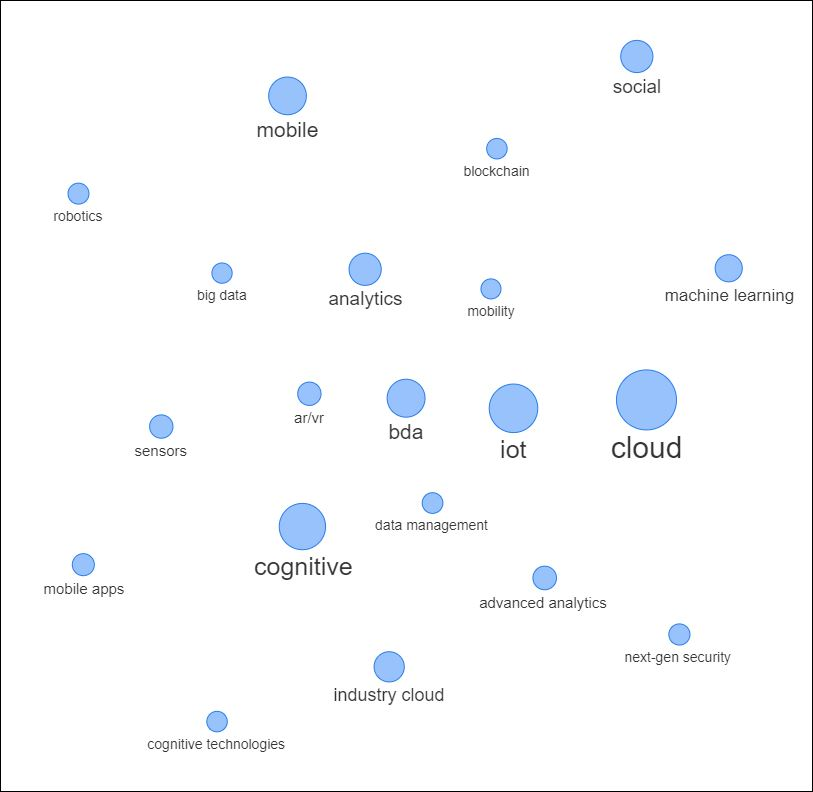
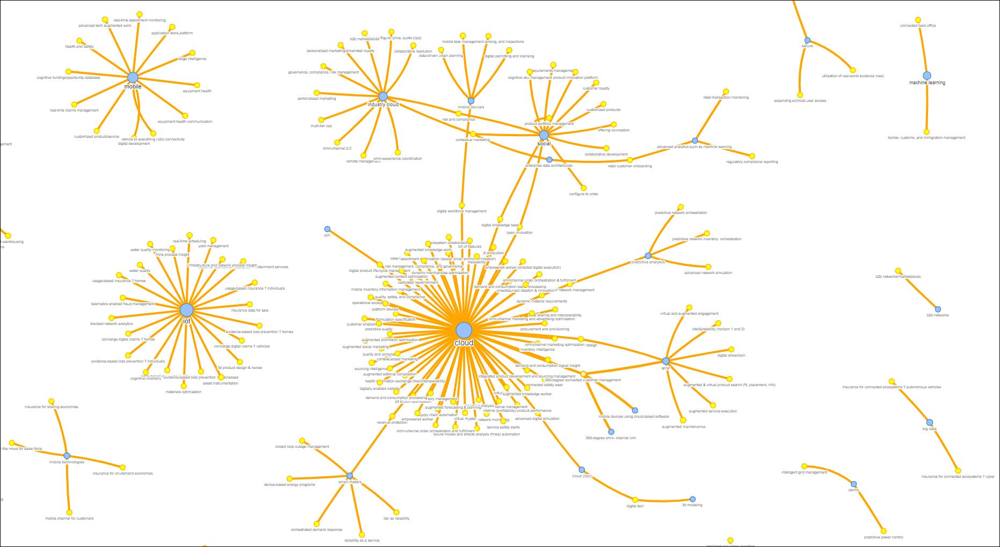

# Request from Shawn@IDC

>
>It would be interesting to see the digital explorer views/outputs created and sorted by the following (including cluster and >nearest neighbor analysis):
>
>1.	Industry to missions to strategic priorities to programs
>2.	Technology to programs to strategic priorities to missions to industries`
>

----

## 1

~~~

~~~

- 1 [images/IMSPP.png](images/IMSPP.png)
- 2 use cases bridge the gap between Programs and Technologies

other views

- top 20 referenced technologies

- top 20 reference technologies and usecases

